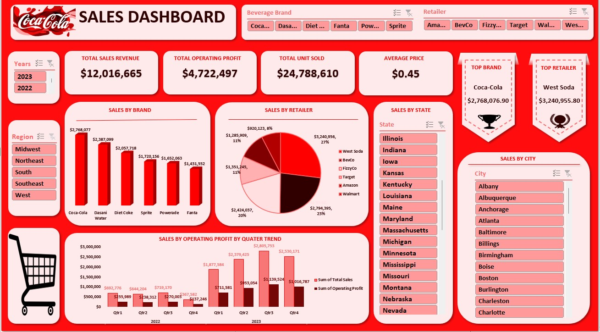

# Coca Cola Sales Data EDA Using Microsoft Excel
&nbsp;
  

## Introduction
In an ever-changing and very competitive consumer products industry, companies like Coca-Cola always face problems in maintaining and increasing sales. If they want to stay ahead of the market and overcome these challenges, they need to use innovative, data-driven methods for in-depth sales analysis.

My goal in this project focuses on using Exploratory Data Analysis(EDA) techniques such as Data Cleaning and Preprocessing, Data Exploration, Data Visualization, Data Interpretation and Reporting to analyze Coca-Cola’s sales data of year 2022 to 2023.I plan to uncovering hidden patterns and 
relationships, with the aim to provide actionable insights for optimizing sales growth strategies. 
&nbsp;
  
   &nbsp;
   
## Data Summary
This Sales dataset key columns include Retailer, Retailer ID, Invoice Date, Region, State, City, Product, Price per Unit, Units Sold, Total Sales Amount, Operating Cost, New Operating Profit, Operating Margin. The data has certain limitations; absence of customer details, sales methods, marketing strategies employed is not started which can help to understand what channel to concentrate resources on for most profitable customers, sales method and the most effective marketing strategies to employ.
&nbsp;
  
   &nbsp;
   
## Key Questions to Explore

📍 **Sales Analysis:**

Identify sales performance metrics

📍 **Time Series Analysis:**

Examine sales trends over time to identify seasonality and potential patterns.

📍**Product Analysis:2**

Sales performance of individual product.
Identify products that contribute significantly to revenue.

📍 **Geographical Analysis:**

Evaluate sales performance across different regions.
Identify high-performing regions and areas.
   &nbsp;
  
   &nbsp;

## Conclusion and Recommendations

* To increase sales in every quarter, the same marketing strategy used in the third quarter of 2023 should be repeated.

* To maximize sales performance, priority must be placed on the product category and marketing strategies can be focused on the top product (i.e., Coca-Cola). Meanwhile, Dasani Water and Diet Coke are close to performing across the regions, an effective marketing strategy will increase sales performance.

* Fanta sold more units than Powerade, but had a lower profit margin. In order to boost sales, Fanta's price per unit could be raised.

* Since New York, California, Florida and Texas are the top-performing states, additional resources ought to be set aside for focused marketing campaigns in these states.

* Increasing revenue directly affects sales and therefore the goal must be to increase influence by increasing throughput (sales volume) ultimately improving tactics for sales or marketing strategies including quality of product offerings as well as customer engagement. You always need to keep an eye out for sales data and analyze it in detail so that you can understand the trends and opportunities for further improving sales performance and revenue generation.

* As the most profitable product that Coca Cola merges, the company should look to increasing its production and potentially selling at lower price per unit in order to attract a bigger consumer base.

* Concentrating on having ample product stock in the top-performing city while doubling down advertising budgeting spend in such cities is very key. Effective collaboration is required between the company and distributors to ensure adequate product availability in these locations.

* Your company definitely needs to work on its sales strategy (ideally by dropping the price per product or running a promotion where you buy five and get the sixth for free). The company are most likely going to catch the attention of more customers. Furthermore, the company need to focus on there marketing efforts.

* With the best discounts possible to top retailers and manufacturing exclusive products in high-performing regions are other ways by which the company can achieve even more profit.
